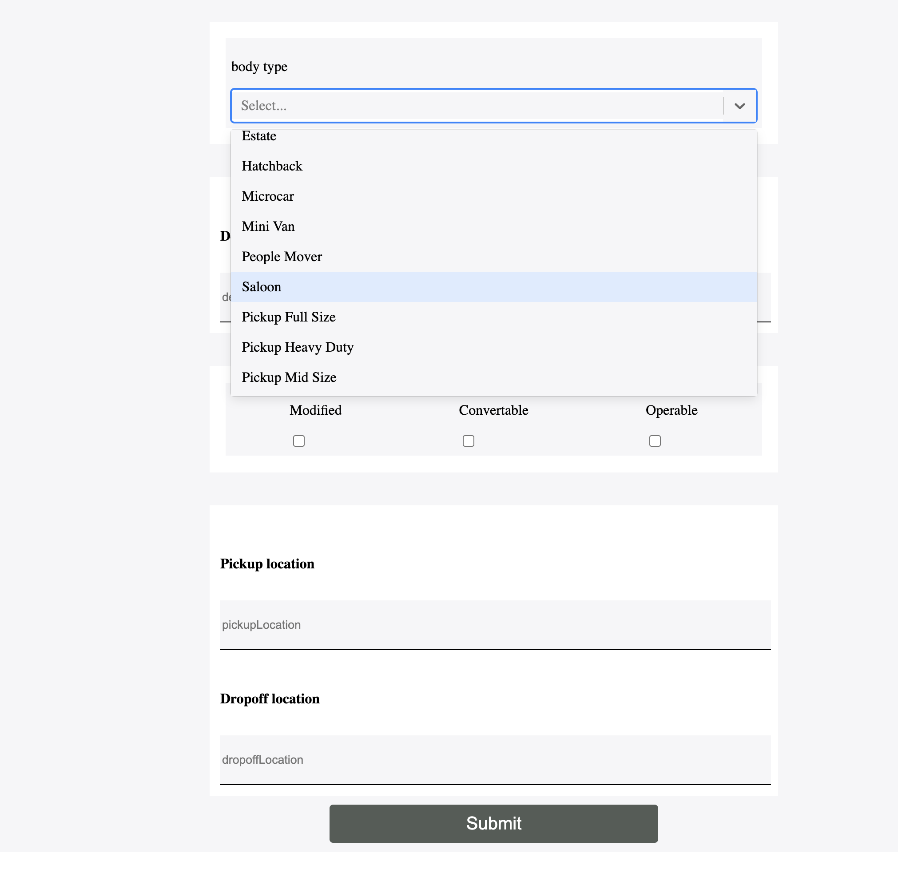
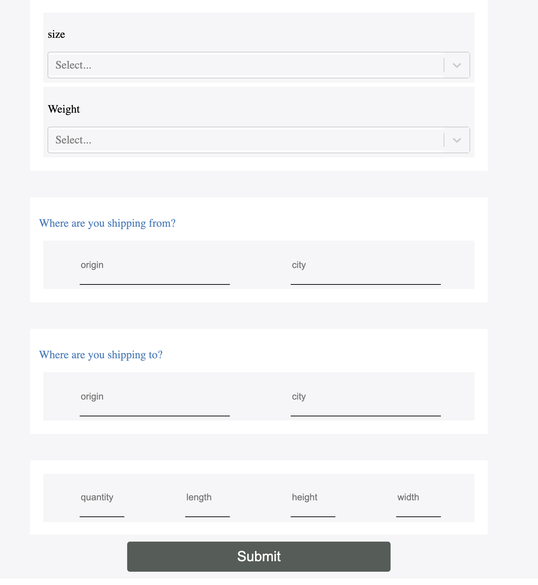
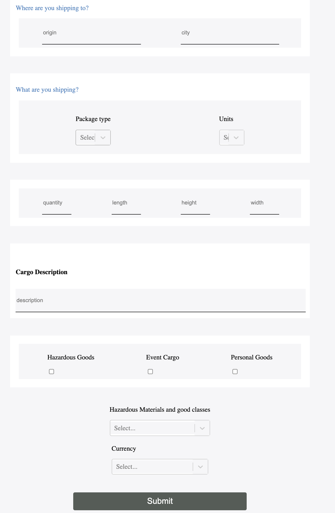

# Customer feedback form with SVG animations and firebase

##### Setup node modules

```
npm install
```

##### Compiles and runs at http://localhost:3000/

```
npm start
```

## About

React js form example app integrated with firebase, form inputs include picker, input and checkboxes.






# freight-forms
